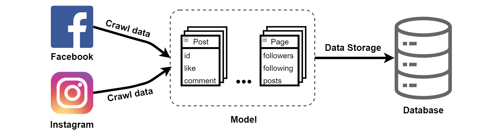

# Web Crawler (FB & IG)

This repository consists of 2 web crawlers.
They both uses the language Python and library Selenium.

By using the crwalers, we can keep track of the number of likes, comments of the page.
Then we can analyze the trend of the pages by using various visualisations.

The environment file (environment.yml) is included in the source file.

# Flowchart of the Web Crawler

 
