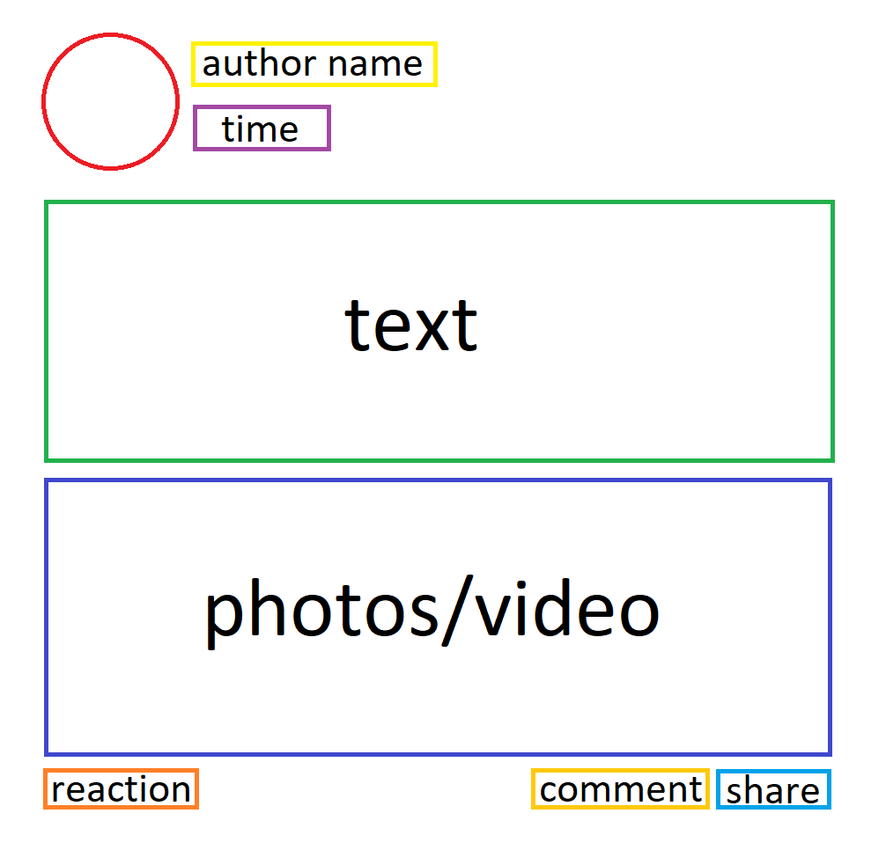
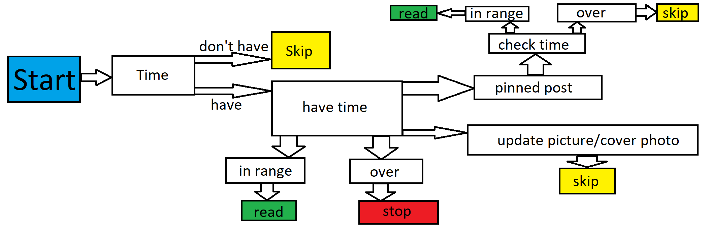
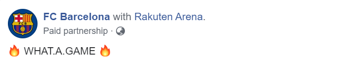

## Documentary for python file fbWebCrawler.py 

##### Python version
This python file is using python version 2.7.16

##### Facebook Account 
The crawler always expects that the Facebook account has no friends. Also, it always expects that the account did not reacted to any post(s).

For example,
"John and 123 others" could lead to error.

Since, the crawler will cast "John and 123 others" to String.

### Parameters available for this program:

#### Example cmd:
    python.exe fbWebCrawler.py --pageURL="https://www.facebook.com/pg/apple/posts/?ref=page_internal" --days=7 --mode="login" --host="127.0.0.1" --port=8000

# 

#### 1. URL of the page

A form of "https://www.facebook.com/pg/XXXXXXXX/posts/?ref=page_internal" for a Facebook page is expected.

An example URL of a Facebook page:

    --pageURL="https://www.facebook.com/pg/apple/posts/?ref=page_internal"

A form of "https://www.facebook.com/XXXXXXXX/posts/YYYYYYY" for a Facebook page is expected.

An example URL of a single post by a Facebook page:

    --pageURL="https://www.facebook.com/hk.nextmedia/posts/10158053386662448"

#### 2. Guest mode

A String is expected. Only "login" and "logout" are available.

Logout mode is intended to save the cookies and local storage of the corresponding account, but not crawling any feed(s) of any page(s).

Example:

    --mode="login"

This would change the boolean(guest_mode) in the program.

#### 3. Time of the post we need to crawl

An int is expected.

Example for crawling the posts of this recent week:

    --days=7

#### 4. Email address of the Facebook account

A String is expected.

Example:

    --email="abc@gmail.com"

#### 5. Password of the Facebook account

A String is expected.

Example:

    --password="777689616"

#### 6. Host of the server

A String is expected.

Example:

    --host="127.0.0.1"

#### 7. Port of the server

An int is expected.

Example:

    --port=5000

### Model

#### 1. Feed

|Attributes |Data Type|Description                                  |
|---        |---      |---                                          |
|id         |int      |unique identifier from Facebook (primary key)|
|full_text  |String   |full text of the post                        |
|author_name|String   |the name of the author                       |
|reactions  |int      |the number of reactions in total             |
|crawled_dt |String   |the date of the post crawled                 |
|post_dt    |String   |the date of the post published               |
|like       |int      |the number of like of the post               |
|love       |int      |the number of love of the post               |
|angry      |int      |the number of angry of the post              |
|wow        |int      |the number of wow of the post                |
|haha       |int      |the number of haha of the post               |
|sad        |int      |the number of sad of the post                |
|comment    |int      |the number of comment of the post            |
|share_count|int      |the number of share of the post              |

#### 2. Page

|Attributes                |Data Type|Description                                  |
|---                       |---      |---                                          |
|author_name               |String   |the name of the author                       |
|ads                       |Boolean  |whether the page has advertisement(s)        |
|page_created_date         |String   |the date of the page created                 |
|total_number_of_manager   |int      |the number of managers of the page in total  |
|manager                   |String   |the location of the manager                  |

#### 3. Hashtag

|Attributes |Data Type|Description                                  |
|---        |---      |---                                          |
|feed_id    |int      |the id of the post                           |
|text       |String   |the hashtag                                  |

### Crawling steps of the program

#### 1. Identify whether the URL is a feed or a page

If "/pg/" is in the URL, then we would know the link will redirect us to the Facebook page.

Otherwise it is a single post.

#### 2. Procedure of reading feeds

I. Checking the time of the feed, if the time is out of range, the boolean(booleanToExitWhileLoop) of the program will change to false.

II. Then we will take the information of the feed from top to bottom, ranging from the author of the feed to the id of the feed.

III. After that, we post the information(hashtag, post) to the server.

#### 3. Reading the page

I. Then we will locate the home button of the Facebook page and click into it.

II. Then we will take the information of the page from left to right.

III. After that, we post the information of the page to the server.

### Testing mode

Sometimes when the server is turned off, we can still test the functionality of the program, and run it.

When the boolean(serverOn) is False:

    serverOn = False

The program will skip the lines relating to the server.

### Reference

#### The basic structure of a Facebook feed

#### Case for readFeed function

In case that the time of the post is not provided, here's an example:

