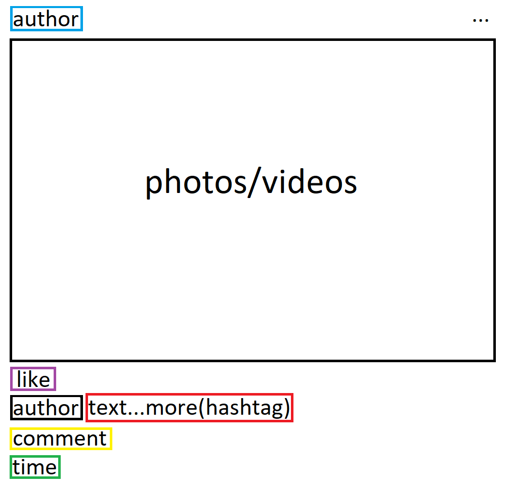
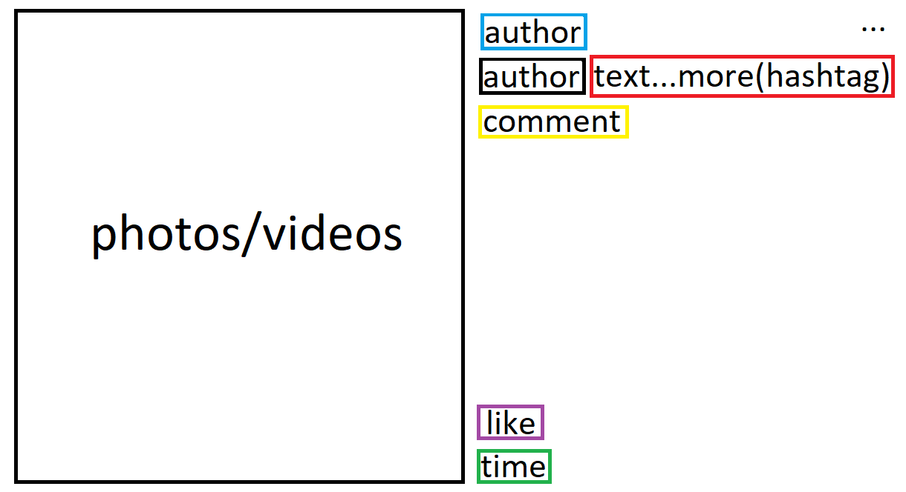

## Documentary for python file igWebCrawler.py 

##### Python version
This python file is using python version 2.7.16

##### Header added to the browser
The browser has added an iOS header. It helps the browser to read post from top to bottom using the scrolling bar.

    options.add_argument('user-agent="Mozilla/5.0 (iPod; U; CPU iPhone OS 2_1 like Mac OS X; ja-jp) AppleWebKit/525.18.1 (KHTML, like Gecko) Version/3.1.1 Mobile/5F137 Safari/525.20"')

##### Instagram Account 
This crawler always expect that the Instagram account has no followers/following account(s).

For example,
"Liked by abc689 and 777 others" could lead to error.

Since, the crawler will cast "abc689 and 777 others" to String.

### Parameters available for this program:

#### Example cmd:
    python.exe igWebCrawler.py --pageURL="https://www.instagram.com/google/feed/" --days=7 --mode="login" --host="127.0.0.1" --port=8000
    
# 

#### 1. URL of the page

A form of "https://www.instagram.com/XXXXXXX/feed/" for a Instagram page is expected.

An example URL of a Instagram page:

    --pageURL="https://www.instagram.com/apple/feed/"

A form of "https://www.instagram.com/p/XXXXXXX/" for a single Instagram post is expected.

An example URL of a single post by a Instagram page:

    --pageURL="https://www.instagram.com/p/B2UT-qaFKgy/"

#### 2. Guest mode

A String is expected. Only "login" and "logout" are available.

Logout mode is intended to save the cookies and local storage of the corresponding account, but not crawling any post(s) of any page(s).

Example:

    --mode="login"

This would change the boolean(guest_mode) in the program.

#### 3. Time of the post we need to crawl

An int is expected.

Example for crawling the posts of the last 43 days:

    --days=43

#### 4. Email address of the Facebook account

A String is expected.

Example:

    --email="tmr@rain.com"

#### 5. Password of the Facebook account

A String is expected.

Example:

    --password="721nky831dsy"

#### 6. Host of the server

A String is expected.

Example:

    --host="127.0.0.1"

#### 7. Port of the server

An int is expected.

Example:

    --port=5000

### Model

#### 1. Post
##### - id (String)
id is taken from the URL, for example:
https://www.instagram.com/p/B2UT-qaFKgy/
id = B2UT-qaFKgy
##### - full_text (String)
##### - author_name (String)
##### - crawled_dt (String)
##### - post_dt (String)
##### - like (int)
##### - comment (int)

#### 2. Page
##### - author_name (String)
##### - posts (int)
##### - followers (int)
##### - following (int)

#### 3. Hashtag
##### - feed_id (String)
##### - text (String)

### Crawling steps of the program

#### 1. Identify whether the URL is a post or a page

If "instagram.com/p/" is in the URL, then we would know the link will redirect us to the Instagram post.

Otherwise it is a Instagram page.

#### 2. Reading the page

I. Reading the author name of the page.

II. Then we will take the post number, followers number and the number of following.

III. After that, we post the information of the page to the server.

#### 3. Procedure of reading posts

I. Checking the time of the post, if the time is out of range, the boolean(booleanToExit) of the program will change to false.

II. Then we will take the information of the post from top to bottom, ranging from the id of the post to the number of comments of the post.

III. After that, we upload the information(hashtag, post) to the server.

### Testing mode

Sometimes when the server is turned off, we can still test the functionality of the program, and run it.

When the boolean(serverOn) is False:

    serverOn = False

The program will skip the lines relating to the server.

### Reference

#### The basic structure of a Instagram post

#### The basic structure of a single Instagram post

